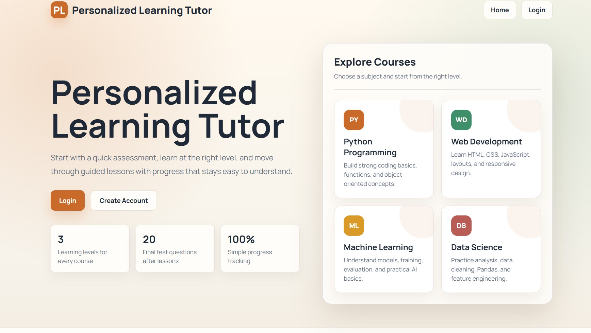
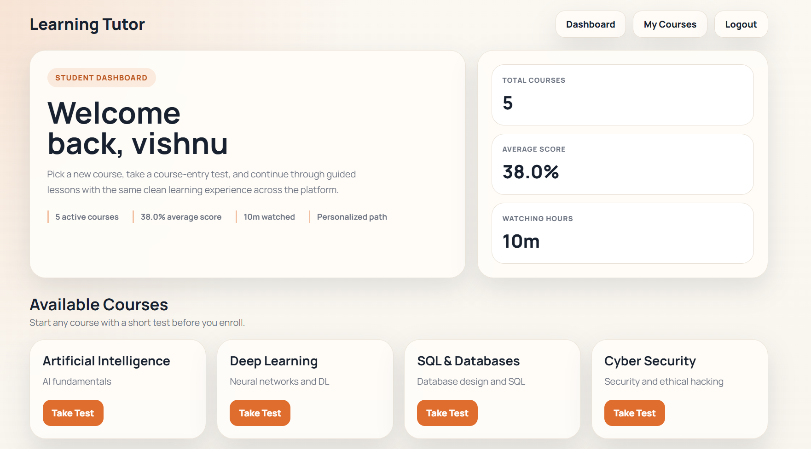
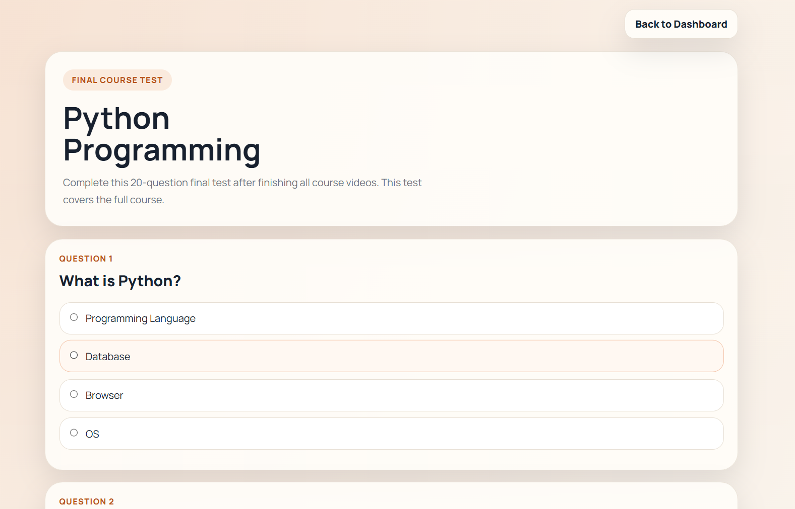
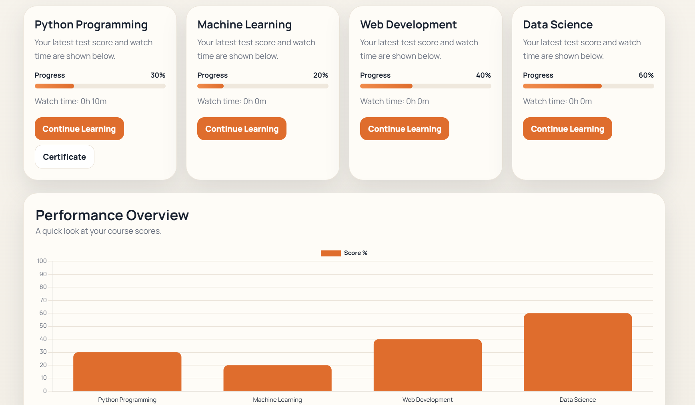

<div align="center">

# 🎓 Adaptive Learning Tutor

**A self-adjusting online learning platform that changes course difficulty in real time based on how each student performs.**

Built with Python, Flask, and SQLite — designed and implemented the backend architecture, adaptive-testing engine, and progress-tracking system as part of a 4-person team.

[](https://www.python.org/)
[](https://flask.palletsprojects.com/)
[](https://www.sqlite.org/)
[](LICENSE)

[Live Demo](#) · [Report Bug](../../issues) · [Request Feature](../../issues)

</div>

---

## 📌 Overview

Most online courses treat every student the same. This platform doesn't — it re-scores and re-routes each learner through content based on **entry, checkpoint, and final assessments**, adjusting difficulty across 15 course tracks (Python, ML, Web Dev, Data Science, DevOps, and more).

**My contribution:** Flask application architecture, database schema design (SQLite), the adaptive test-staging engine, and the student progress/certificate system. *(Adjust this line if you want to name what teammates owned separately.)*

---

## 🖼️ Screenshots

<table>
<tr>
<td width="50%">

**Landing Page**


</td>
<td width="50%">

**Student Dashboard**


</td>
</tr>
<tr>
<td width="50%">

**Adaptive Final Test**


</td>
<td width="50%">

**Performance Overview**


</td>
</tr>
</table>

---

## ✨ Key Features

| | |
|---|---|
| 🧠 **Adaptive Assessments** | Entry, checkpoint, and final tests per course, with difficulty and question sets that scale based on stage and performance |
| 🛤️ **Dynamic Learning Paths** | Course content re-orders itself around a Beginner / Intermediate / Advanced level derived from test scores |
| 📊 **Progress Tracking** | Tracks per-lesson watch time, completion, and step-by-step progress for every student, per course |
| 🏆 **Auto-Issued Certificates** | Generated on final-assessment completion and tied to the student's score |
| 📚 **Multi-Course Enrollment** | Students track multiple courses at once, with an aggregate dashboard (average score, total watch time, courses completed) |
| 🗃️ **15 Course Tracks** | Python, ML, Web Dev, Data Science, AI, Deep Learning, SQL, Cyber Security, Cloud, Java, C, DSA, OS, Networks, DevOps |

---

## 🧠 How the Adaptive Engine Works

```
 Student enrolls
      │
      ▼
 Entry Test (5 questions)  ──►  sets initial level: Beginner / Intermediate / Advanced
      │
      ▼
 Learning Path served for that level
      │
      ▼
 Checkpoint Test (5 questions)  ──►  re-evaluates and can shift difficulty
      │
      ▼
 Final Test (up to 20 questions)  ──►  determines certificate eligibility + score
```

The staging logic lives in `get_test_questions()` in `app.py`, which slices a course's question bank differently depending on stage (`entry` / `checkpoint` / `final`).

---

## 🛠️ Tech Stack

| Layer | Technology |
|---|---|
| **Backend** | Python, Flask (REST-style routes), Flask-CORS |
| **Database** | SQLite (dev), designed for straightforward migration to MySQL |
| **Frontend** | HTML, CSS, JavaScript, Jinja2 templates |
| **Data Model** | 7 relational tables — `students`, `courses`, `questions`, `enrollments`, `learning_progress`, `watch_progress`, `certificates` — with foreign keys and indexes for query performance |

<details>
<summary><b>Schema highlights</b></summary>

- Foreign keys with `ON DELETE CASCADE` keep enrollment, progress, and certificate data consistent when a student or course is removed.
- Composite unique constraints (e.g. `UNIQUE(student_id, course_id)`) prevent duplicate enrollments and duplicate progress rows.
- Indexes on `enrollments`, `questions`, `learning_progress`, `watch_progress`, and `certificates` keep per-student lookups fast as data grows.

</details>

---

## 🚀 Getting Started

```bash
# 1. Clone the repo
git clone https://github.com/Vishnu052004/personalized-learning-tutor-with-adaptive-learning.git
cd personalized-learning-tutor-with-adaptive-learning

# 2. Install dependencies
pip install -r requirements.txt

# 3. (Optional) set a secret key — a dev default is used otherwise
export FLASK_SECRET_KEY="your-secret-key"

# 4. Run the app
python app.py
```

The app runs at **http://localhost:5000**. The SQLite database and default course/question data are created automatically on first run.

---

## 📂 Project Structure

```
├── app.py               # Flask app, routes, adaptive test-staging logic
├── database.py           # Schema definition, indexes, seed data
├── questions_data.py      # Per-course question banks
├── videos_data.py         # Course/lesson → video content mapping
├── static/
│   └── styles.css
├── templates/             # Jinja2 templates (dashboard, test, learning path, certificate, auth)
└── requirements.txt
```

---

## 🔒 Known Limitations & Roadmap

Being upfront about gaps here is deliberate — it reads as engineering judgment, not a weakness.

- [ ] **Password hashing** — currently stored in plaintext; next step is `werkzeug.security.generate_password_hash`
- [ ] **Production database** — migrate from SQLite to MySQL/Postgres for concurrent multi-user use
- [ ] **Automated tests** — expand `test_db.py` into a real pytest suite covering the adaptive-staging logic
- [ ] **Deployment** — ship a live demo (Render/Railway) and link it at the top of this README
- [ ] **Auth hardening** — session expiry, rate limiting on login

---

## 👥 Team

Built as a major project at **JB Institute of Engineering & Technology**, under the guidance of Mrs. Zohra Naval, Assistant Professor.

## 📬 Contact

**Koleti Vishnuvardhan**
📧 vishnuvardhankoleti@gmail.com · 🔗 [LinkedIn](https://www.linkedin.com/in/koleti-vishnuvardhan-7248a629a)

---

<div align="center">
<sub>If this project is useful or interesting, a ⭐ helps others find it.</sub>
</div>
